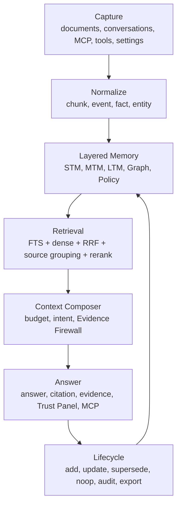

# Memori-Vault

[](./LICENSE)
[](https://www.rust-lang.org)
[](https://github.com/FPSZ/Memori-Vault/actions/workflows/rust-ci.yml)

**Ask your documents. Know exactly where the answer came from.**

[中文](./README.md) | [Contributing](./CONTRIBUTING.en.md) | [Tutorial](./docs/TUTORIAL.md) | [Memory OS Lite Architecture](./docs/MEMORY_OS_LITE.md)

---

## What Problem Does It Solve?

Knowledge does not live in one chat window. It is scattered across Markdown files, TXT notes, PDFs, DOCX documents, code docs, project decisions, meeting notes, conversations, and agent tool calls. A typical RAG system can vectorize this content and return a plausible answer, but it often fails the questions that matter:

- Which exact file and chunk supports this answer?
- If evidence is weak, will the system refuse or hallucinate?
- How do agent-generated memories get saved, updated, audited, and superseded without polluting document evidence?

Memori-Vault is a **Local-first Verifiable Memory OS Lite**: a local, auditable memory engine that separates document evidence, conversation memory, project memory, graph context, model policy, and MCP agent access into explicit layers. It is designed to make a local knowledge base not only searchable, but trustworthy, traceable, and callable by agents.

By default, there is no cloud dependency, no mandatory external vector database, and no heavy SaaS stack. Core data stays in local SQLite, which makes Memori-Vault suitable for personal knowledge bases, engineering team knowledge bases, private deployment, and local agent memory.

---

## Why Not Other RAG Tools?

| What You Care About | Typical RAG / Knowledge-Base Tooling | Memori-Vault |
| --- | --- | --- |
| Data location | Cloud service, remote vector DB, heavy service stack | Local SQLite file by default |
| Offline use | Often depends on cloud models or hosted services | Works with local models and local indexes |
| Answer trust | Usually shows a loose source list | Chunk-level citations, evidence, source groups, retrieval metrics |
| Insufficient evidence | Often still generates a plausible answer | Strong-evidence gating and explicit insufficient-context status |
| Chinese / CJK | Often treated as an afterthought | CJK, Traditional Chinese, mixed English/Chinese, code tokens, paths, and API names are core cases |
| Long-term conversation memory | Often dumps chat logs into vector search | STM/MTM/LTM layers with source, lifecycle, and audit |
| Agent integration | Custom HTTP wrappers or vendor-specific plugins | Official MCP for Claude Code, Codex, OpenCode, and local agents |
| Graph | Missing or mixed into opaque ranking | Graph is evidence exploration and temporal relationship context, not main ranking |
| Governance | SaaS permissions or heavy deployment | Local-first, egress policy, audit, RBAC/private deployment preview |
| License | AGPL, proprietary, or commercial restrictions | Apache 2.0 |

Memori-Vault is not trying to become an AnythingLLM clone. It focuses on a narrower and sharper product promise: **local, lightweight, trustworthy, verifiable, CJK-friendly, and agent-callable memory**.

---

## Core Strengths

### 1. Verifiable Answers, Not Plausible Summaries

Structured answers are built around an evidence chain:

- `citations`: which files and chunks support the answer.
- `evidence`: original matched snippets, hit reasons, and ranking signals.
- `source_groups`: aggregation for duplicate or sibling sources, especially `.txt/.md` pairs.
- `metrics`: retrieval, merge, and generation timings.
- `failure_class`: recall miss, rank miss, gating false negative, generation refusal, or citation miss.

This makes the system explainable to users and debuggable for engineers. If there is not enough evidence, the correct behavior is to say so.

### 2. Evidence Firewall

Long-term memory is useful, but dangerous if it is mixed into document evidence. Preferences, project context, historical conversations, and agent summaries may help the answer, but they must not be disguised as file citations.

Memori-Vault separates sources:

- Document QA prioritizes document/chunk evidence.
- Conversation, project, and preference memory is returned as `memory_context`.
- `answer_source_mix` declares whether an answer is `document_only`, `document_plus_memory`, `memory_only`, or `insufficient`.
- Document citations can only come from document chunks.

This is the Evidence Firewall: long-term memory can help context without weakening the evidence chain.

### 3. Local-first Verifiable Memory OS Lite

Memori-Vault is not just a vector store and not a strategy of stuffing everything into long context. It uses layered memory:

| Layer | Stores | Purpose | Can It Be a Document Citation? |
| --- | --- | --- | --- |
| STM | Current session, active task, temporary tool results | Short-term working memory | No |
| MTM | Session summaries, project context, recent decisions, failure records | Cross-session context | Only as memory source |
| LTM | Document chunks, stable facts, durable preferences, project decisions | Long-term knowledge and preference | Document facts must be citeable |
| TKG | Entities, relations, source chunks, time, conflicts | Graph explanation and timeline | Only sourced nodes and edges |
| Policy | Egress policy, scope, agent write rules, model strategy | Governance boundary | No |

Implemented or partially implemented today:

- SQLite Memory Domain: `memory_events`, `memories`, `memory_lifecycle_log`.
- Memory lifecycle operations: add, search, update, supersede, lifecycle log.
- Ask-time Memory Router / Context Composer v1.
- Trust Panel for answer source mix, failure class, token budget, source groups, and memory context.
- Evidence compression so ordinary QA sends only the strongest evidence to the answer model.

See [docs/MEMORY_OS_LITE.md](./docs/MEMORY_OS_LITE.md) for the full architecture.

### 4. SQLite Single-File Runtime

The default runtime keeps SQLite as the storage kernel:

- Documents, chunks, FTS, vectors, graph metadata, memory, lifecycle logs, and audit data can stay local.
- Backup, migration, and private deployment remain simple.
- A local knowledge-base product does not need to become a Milvus/Chroma/Postgres/Docker cluster by default.
- External vector adapters can be added later, but they should remain optional.

This makes Memori-Vault a good fit for desktop tools, local services, private networks, and personal/team agent memory.

### 5. CJK and Mixed-Token Retrieval

Real Chinese knowledge bases contain Simplified Chinese, Traditional Chinese, English abbreviations, paths, API names, code symbols, and business filler words. Memori-Vault treats these as first-class retrieval cases:

- Chinese/CJK query analysis.
- Traditional Chinese and Simplified Chinese content.
- Mixed English/Chinese queries.
- `snake_case`, `kebab-case`, `CamelCase`, paths, APIs, and function names.
- Same-name files, duplicate document pairs, descriptive questions, and no-answer questions.

The near-term quality target is a fixed 50-case test set: answer at least 45, answer at least 40 correctly, and hit citations/source groups at least 45 times.

### 6. Official MCP for Agents

Memori-Vault exposes an official MCP server instead of only a custom HTTP endpoint. Agents can use the local vault through standard MCP tools.

Query and evidence:

- `ask`
- `search`
- `get_source`
- `open_source`

Memory:

- `memory_search`
- `memory_add`
- `memory_update`
- `memory_list_recent`
- `memory_get_source`

Indexing, model settings, app settings, and graph tools are also exposed through MCP. Full-control mode can manage local runtime state, but long-term memory writes must carry source, audit, and a reversible lifecycle path.

### 7. Graph for Explanation, Not Main Ranking

Graph-RAG is valuable, but it should not become an opaque ranking dependency before the main evidence chain is stable. Memori-Vault uses graph as:

- Evidence exploration.
- Entity and relationship visualization.
- Source chunk backtracking.
- Temporal relationship and conflict explanation.
- A non-blocking background layer.

Graph extraction failure must not break ask/search, and graph score should not affect main ranking in the P1 architecture.

---

## Quick Start

### Desktop Development

```bash
git clone https://github.com/FPSZ/Memori-Vault.git
cd Memori-Vault

pnpm --dir ui install
pnpm --dir ui run dev -- --host 127.0.0.1 --port 1420 --strictPort
cargo tauri dev -p memori-desktop
```

### Server Only

```bash
cargo run -p memori-server
```

Default server URL:

```text
http://127.0.0.1:3757
```

MCP HTTP endpoint:

```text
http://127.0.0.1:3757/mcp
```

### Local Model Roles

Memori-Vault can use different local models for different jobs:

```bash
MEMORI_CHAT_ENDPOINT=http://localhost:18001   # main answer model, e.g. Qwen3 14B
MEMORI_GRAPH_ENDPOINT=http://localhost:18002  # graph/summary/settings helper, e.g. Qwen3 8B
MEMORI_EMBED_ENDPOINT=http://localhost:18003  # embedding model, e.g. Qwen3-Embedding-4B
```

Do not treat long context as the default memory strategy:

- Ordinary QA: 8K-16K.
- Multi-document synthesis: 16K-32K.
- 64K: offline long-document summarization, batch processing, or map-reduce, not the default online ask path.

---

## Architecture



### Module Map

| Module | Responsibility |
| --- | --- |
| `memori-parser` | Parsing and semantic chunking for Markdown/TXT/PDF/DOCX and future formats |
| `memori-storage` | SQLite schema, documents, chunks, FTS, graph, memory, lifecycle log |
| `memori-core` | Query analysis, document routing, chunk retrieval, RRF/gating, Memory Router, Context Composer |
| `memori-server` | Axum HTTP API, MCP endpoint, server runtime, private deployment entry |
| `memori-desktop` | Tauri commands, desktop lifecycle, settings persistence, model runtime coordination |
| `ui` | React UI, settings, Evidence/Trust Panel, source preview, graph and memory UI |
| `deploy` | systemd, environment templates, backup/restore private deployment assets |

### Ask Path

```text
analyze query
-> document routing
-> memory context search
-> chunk retrieval
-> RRF merge and gating
-> context composer
-> answer synthesis
-> citation/evidence/source_groups/memory_context
-> Trust Panel / MCP response
```

### Retrieval Boundary

The main retrieval chain remains:

```text
document routing -> chunk retrieval -> RRF/gating -> evidence/citation
```

Graph, conversation memory, and project memory are explanation/context layers by default. They should not rewrite main ranking until the evidence chain is stable enough.

---

## Current Status

Implemented or partially implemented:

- Desktop QA, citations, evidence, settings, and model configuration.
- Server HTTP API and MCP endpoint.
- SQLite document indexing, FTS/dense hybrid retrieval, RRF/gating.
- Memory Domain v1 with memory tables, lifecycle log, and memory MCP tools.
- Trust Panel and structured source fields.
- Source grouping and evidence compression.
- Enterprise private deployment preview with RBAC, audit, egress policy, and backup/restore templates.

Still in progress:

- 50-case acceptance set: `answered >= 45/50`, `correct >= 40/50`, `citation/source_group_hit >= 45/50`.
- PDF/DOCX/HTML ingestion hardening.
- Lower gating false negatives, especially for `.txt`, Traditional Chinese, and duplicate document pairs.
- Temporal graph explanation and graph visualization.
- Markdown source-of-truth / export.
- Memory heat score, conflict resolver, lifecycle classifier.
- Continued large-file split for maintainability.

---

## Who Is It For?

- Individuals who want a local document QA system without sending data to the cloud.
- Engineering teams working with Chinese, Traditional Chinese, mixed English/Chinese, and code documentation.
- Developers who want Claude Code, Codex, OpenCode, or local agents to use a local knowledge base and long-term memory.
- Organizations that need private deployment, audit, model egress policy, and local governance.
- Workflows where every answer must be traceable to evidence, not just fluent.

---

## What It Does Not Do

- No default cloud sync.
- No mandatory remote vector database.
- No conversation memory disguised as document citations.
- No graph ranking in the P1 main retrieval path.
- No claim that 50k-document high-precision validation is already complete.
- No assumption that long context replaces memory architecture.

---

## License

Apache License 2.0.
