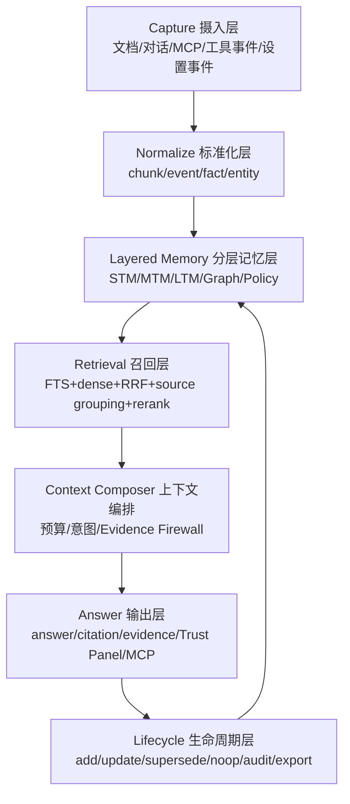

# Memori-Vault

[](./LICENSE)
[](https://www.rust-lang.org)
[](https://github.com/FPSZ/Memori-Vault/actions/workflows/rust-ci.yml)

**问你的文档，知道答案从哪里来。**

[English](./README.en.md) | [贡献指南](./CONTRIBUTING.md) | [教程](./docs/TUTORIAL.zh-CN.md) | [Memory OS Lite 架构](./docs/MEMORY_OS_LITE.md)

---

## 解决什么问题？

企业和个人的知识不是只存在一个聊天窗口里。它们散落在 Markdown、TXT、PDF、DOCX、代码文档、项目记录、会议结论、对话上下文和 agent 工具调用里。普通 RAG 可以把这些内容向量化，然后给你一个“看起来相关”的答案，但它经常回答不了三个关键问题：

- 这个答案到底来自哪一份文件、哪一个片段？
- 如果文档证据不足，它会不会为了完成回答而编造？
- agent 或长期对话产生的新记忆，怎么保存、更新、审计、撤销，而不污染原始文档证据？

Memori-Vault 的定位是 **Local-first Verifiable Memory OS Lite**：一个本地优先、可验证、可审计的长期记忆引擎。它把文档证据、对话记忆、项目记忆、图谱上下文、模型策略和 MCP agent 接口分层管理，让本地知识库不只是“能搜”，而是能被信任、能被追溯、能被 agent 调用。

默认不依赖云端，不默认引入外部向量数据库，不要求复杂 Docker/SaaS 架构。核心数据保存在本机 SQLite 中，适合个人知识库、研发团队内网知识库、私有化部署和本地 agent memory。

---

## 为什么不用其他 RAG 工具？

| 你关心的事     | 典型 RAG / 知识库工具              | Memori-Vault                                                               |
| -------------- | ---------------------------------- | -------------------------------------------------------------------------- |
| 数据在哪里     | 云服务、远程向量库、重型服务栈     | 本地 SQLite 单文件，默认留在你的机器上                                     |
| 能否离线运行   | 通常需要云模型、云服务或远程数据库 | 可配本地模型，本地文档、本地索引、本地记忆                                 |
| 答案是否可信   | 通常只给一个 sources 列表          | chunk 级 citation、evidence、source group、retrieval metrics               |
| 证据不足怎么办 | 容易继续生成“可能正确”的回答     | 强证据 gating，不足时明确拒答或标记不足                                    |
| 中文/CJK       | 往往是后补能力                     | CJK、繁体、中英混合、代码 token、路径/API 是核心优化场景                   |
| 对话长期记忆   | 常把聊天记录直接塞进向量库         | STM/MTM/LTM 分层，记忆有来源、生命周期、审计                               |
| agent 集成     | 自定义 HTTP wrapper 或插件生态绑定 | 官方 MCP，Claude Code / Codex / OpenCode 可标准接入                        |
| 图谱           | 要么没有，要么参与黑盒排序         | 图谱用于 evidence exploration 和 temporal relationship，不破坏主召回稳定性 |
| 企业治理       | SaaS 权限模型或重型部署            | local-first、egress policy、audit、RBAC/private deployment preview         |
| 许可证         | AGPL、闭源或商业限制               | Apache 2.0                                                                 |

Memori-Vault 不追求复制 AnythingLLM 的“大而全”。它主打一个更窄但更强的方向：**本地、轻量、可信、可验证、中文友好、agent 可调用**。

---

## 核心优势

### 1. 可验证答案，而不是“像答案的摘要”

每次结构化问答都围绕证据链构建：

- `citations`：答案引用了哪些文件、哪些 chunk。
- `evidence`：命中的原始片段、命中原因和排序信息。
- `source_groups`：把同源、同内容、成对重复文档聚合，减少 `.txt/.md` 重复造成的误判。
- `metrics`：展示检索、合并、生成等阶段耗时。
- `failure_class`：区分召回失败、排序失败、gating 误杀、生成拒答、citation 缺失。

这意味着用户和开发者都能回答“为什么它这么答”。如果没有足够证据，系统应该承认不知道，而不是伪造确定性。

### 2. Evidence Firewall：记忆不能冒充文档引用

长期记忆很有价值，但它也很危险。用户偏好、项目上下文、历史对话、agent 总结都可能帮助回答，但它们不能被伪装成文档证据。

Memori-Vault 把来源分清：

- 文档问答优先使用 document/chunk evidence。
- conversation/project/preference memory 进入 `memory_context`。
- `answer_source_mix` 标明答案是 `document_only`、`document_plus_memory`、`memory_only` 还是 `insufficient`。
- 文档 citation 只能来自文档 chunk，不能来自对话记忆。

这就是 Evidence Firewall。它保证“长期记忆”不会破坏“可验证证据链”。

### 3. Local-first Verifiable Memory OS Lite

Memori-Vault 的架构不是单纯的向量库，也不是把所有内容塞进长上下文。它采用分层记忆：

| 层     | 保存内容                                       | 作用             | 是否能作为文档 citation  |
| ------ | ---------------------------------------------- | ---------------- | ------------------------ |
| STM    | 当前会话、当前任务、临时工具结果               | 短期工作记忆     | 否                       |
| MTM    | 会话摘要、项目上下文、近期决策、失败记录       | 跨会话上下文     | 只能标记为 memory source |
| LTM    | 文档 chunk、稳定事实、长期偏好、项目决策       | 长期知识与偏好   | 文档类必须可 citation    |
| TKG    | 实体、关系、来源 chunk、时间、冲突关系         | 图谱解释和时间线 | 只能展示有来源的节点/边  |
| Policy | egress policy、scope、agent 写入规则、模型策略 | 治理和安全边界   | 否                       |

已经落地或部分落地的能力包括：

- SQLite Memory Domain：`memory_events`、`memories`、`memory_lifecycle_log`。
- 记忆生命周期：add、search、update、supersede、lifecycle log。
- ask-time Memory Router / Context Composer v1。
- Trust Panel：展示答案来源、失败分类、token budget、source groups、memory context。
- evidence compression：普通问答只把最关键证据交给回答模型，降低 14B 全上下文路径的延迟。

完整架构见 [docs/MEMORY_OS_LITE.md](./docs/MEMORY_OS_LITE.md)。

### 4. SQLite 单文件，不默认引入重型依赖

核心运行时继续坚持 SQLite：

- 文档、chunks、FTS、向量、图谱元数据、记忆、生命周期日志、审计信息都可以放在本地。
- 备份、迁移、私有化部署更简单。
- 不需要把一个本地知识库项目变成 Milvus/Chroma/Postgres/Docker 集群项目。
- 未来可以加 external vector adapter，但它应该是可选后端，不是默认依赖。

这个选择让 Memori-Vault 更适合本地工具、桌面应用、内网服务和 agent 个人/团队记忆。

### 5. 中文/CJK 与 mixed-token 是一等公民

真实中文知识库里会同时出现简体、繁体、英文缩写、路径、API 名、代码符号和业务高频词。Memori-Vault 的检索优化会持续覆盖：

- 中文/CJK query 解析。
- 繁体与简体内容。
- 中英混合 query。
- `snake_case`、`kebab-case`、`CamelCase`、路径、API、函数名。
- 同名文件、成对重复文档、描述型问题、无答案问题。

短期验收目标不是“跑一个漂亮 demo”，而是固定 50 条测试：至少回答 45 条，至少正确 40 条，citation/source-group 命中至少 45 条。

### 6. 官方 MCP：让 agent 能直接调用本地记忆

Memori-Vault 提供官方 MCP server，而不是只给一个自定义 HTTP endpoint。agent 可以通过标准 MCP 工具使用本地知识库：

查询与证据：

- `ask`
- `search`
- `get_source`
- `open_source`

记忆能力：

- `memory_search`
- `memory_add`
- `memory_update`
- `memory_list_recent`
- `memory_get_source`

索引、模型、设置、图谱能力也会通过 MCP 暴露给本地 agent。全控制模式下，agent 可以操作索引、模型和设置，但写入长期记忆必须有来源、审计和可撤销路径。

### 7. 图谱用于解释，不抢主检索排序

Graph-RAG 很有价值，但它不应该在主召回还没稳定时成为黑盒排序变量。Memori-Vault 的图谱定位是：

- 展示答案证据涉及哪些实体、关系和文档。
- 支持从 citation 跳到相关实体子图。
- 追踪关系的来源 chunk、时间和冲突。
- 做 temporal relationship 和 evidence exploration。
- 图谱抽取失败不影响 ask/search。

P1 的图谱可视化会专注“解释答案来源”，而不是替代主检索链路。

---

## 快速开始

### 桌面开发模式

```bash
git clone https://github.com/FPSZ/Memori-Vault.git
cd Memori-Vault

pnpm --dir ui install
pnpm --dir ui run dev -- --host 127.0.0.1 --port 1420 --strictPort
cargo tauri dev -p memori-desktop
```

### 仅启动服务端

```bash
cargo run -p memori-server
```

默认服务端地址：

```text
http://127.0.0.1:3757
```

MCP HTTP endpoint：

```text
http://127.0.0.1:3757/mcp
```

### 本地模型建议

Memori-Vault 支持把不同任务交给不同本地模型。推荐三角色分工：

```bash
MEMORI_CHAT_ENDPOINT=http://localhost:18001   # 主回答模型，例如 Qwen3 14B
MEMORI_GRAPH_ENDPOINT=http://localhost:18002  # 图谱/摘要/设置检索模型，例如 Qwen3 8B
MEMORI_EMBED_ENDPOINT=http://localhost:18003  # embedding 模型，例如 Qwen3-Embedding-4B
```

普通问答不建议默认把所有内容塞进 64K 上下文。推荐由 Context Composer 压缩证据后再交给回答模型：

- 普通问答：8K-16K。
- 多文档综合：16K-32K。
- 64K：长文档离线摘要、批处理、map-reduce，不作为默认在线 ask 路径。

---

## 架构



### 模块分工

| 模块               | 职责                                                                                           |
| ------------------ | ---------------------------------------------------------------------------------------------- |
| `memori-parser`  | 解析与语义分块，统一 Markdown/TXT/PDF/DOCX 等内容进入 chunk pipeline                           |
| `memori-storage` | SQLite schema、documents、chunks、FTS、graph、memory、lifecycle log                            |
| `memori-core`    | query analysis、document routing、chunk retrieval、RRF/gating、Memory Router、Context Composer |
| `memori-server`  | Axum HTTP API、MCP endpoint、server runtime、私有化部署入口                                    |
| `memori-desktop` | Tauri commands、桌面生命周期、设置持久化、模型运行时协调                                       |
| `ui`             | React 前端、设置页、Evidence/Trust Panel、source preview、图谱与记忆 UI                        |
| `deploy`         | systemd、环境变量模板、backup/restore 等私有化部署资产                                         |

### 主问答链路

```text
analyze query
-> document routing
-> memory context search
-> chunk retrieval
-> RRF merge and gating
-> context composer
-> answer synthesis
-> citation/evidence/source_groups/memory_context
-> Trust Panel / MCP response
```

### 检索链路边界

主召回链路仍然是：

```text
document routing -> chunk retrieval -> RRF/gating -> evidence/citation
```

图谱、对话记忆和项目记忆是解释与上下文增强层，不默认改变主召回排序。这样做的原因很简单：文档证据链必须先稳定，不能为了“高级架构”牺牲可验证性。

---

## 当前状态

已完成或部分完成：

- 桌面端基础问答、引用、证据、设置、模型配置。
- 服务端 HTTP API 与 MCP endpoint。
- SQLite 文档索引、FTS/dense 混合检索、RRF/gating。
- Memory Domain v1：记忆表、生命周期日志、memory MCP tools。
- Trust Panel 与结构化来源字段。
- Source grouping 与 evidence compression。
- 企业私有化 preview：RBAC、audit、egress policy、backup/restore 模板。

仍在推进：

- 50 条验收集：`answered >= 45/50`、`correct >= 40/50`、`citation/source_group_hit >= 45/50`。
- PDF/DOCX/HTML 摄入稳定化。
- Gating 误杀降低，尤其是 `.txt`、繁体、成对重复文档。
- Temporal graph explanation 与图谱可视化。
- Markdown source-of-truth / export。
- Memory heat score、conflict resolver、lifecycle classifier。
- App.tsx 和后端大文件继续拆分。

---

## 适合谁？

- 想把本地文档变成可问答知识库，但不想把数据上传到云端的个人用户。
- 需要中文、繁体、中英混合、代码文档检索的研发团队。
- 希望 Claude Code、Codex、OpenCode 等 agent 能调用本地知识库和长期记忆的开发者。
- 需要私有化部署、审计、模型外联策略和本地治理的企业团队。
- 需要“答案必须能追溯到证据”的知识工作流，而不是只要一个流畅摘要。

---

## 不做什么？

- 不默认云同步。
- 不默认引入远程向量数据库。
- 不把 conversation memory 冒充成 document citation。
- 不在 P1 让图谱参与主召回排序。
- 不承诺当前已经完成 50k 文档规模高精度验证。
- 不把长上下文当作长期记忆系统的替代品。

---

## 许可证

Apache License 2.0.
