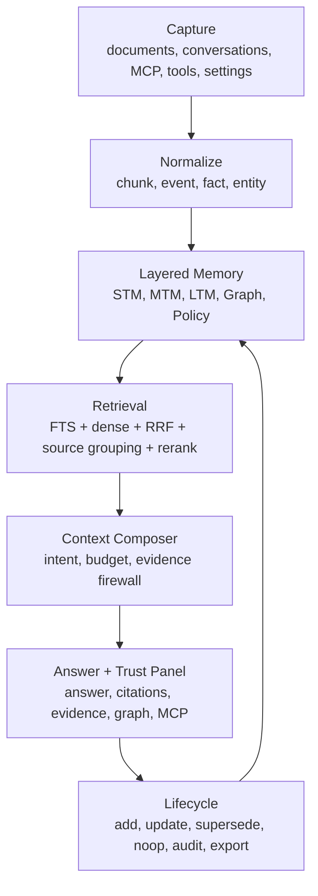

# Memori-Vault Memory OS Lite Architecture

Last Updated: 2026-04-26

Memori-Vault is being standardized around **Local-first Verifiable Memory OS Lite**. The goal is not to become an AnythingLLM clone and not to replace SQLite with a remote vector database. The goal is to keep the current local, lightweight, auditable foundation and add a real memory lifecycle on top of it.

## Positioning

Memori-Vault is a local-first verifiable memory engine for documents, projects, and agents.

The product advantages we should consistently emphasize are:

- **Local-first storage**: documents, chunks, graph metadata, memory records, lifecycle logs, and audit trails stay in local SQLite by default.
- **Verifiable evidence**: document answers must be backed by chunk-level citations, evidence, source groups, and retrieval metrics.
- **CJK and mixed-token focus**: Chinese, Traditional Chinese, English, code tokens, paths, API names, and mixed queries are first-class retrieval cases.
- **Official MCP interface**: agents can query, inspect, control, and write audited memory through standard MCP tools instead of custom one-off HTTP wrappers.
- **Layered memory**: conversation memory, project memory, user preferences, document evidence, graph context, and policy memory are separated instead of being blended into one vector store.
- **Evidence Firewall**: conversation or preference memory may help context, but it cannot masquerade as a document citation.
- **Trust UI**: answers expose `answer_source_mix`, `failure_class`, `source_groups`, `memory_context`, and `context_budget_report` so users can judge why an answer is trustworthy.

## Target Architecture

## Memory Layers

| Layer | Name | Stores | Default Lifecycle | Citation Rule |
| --- | --- | --- | --- | --- |
| `STM` | Short-Term Memory | Current session turns, active task state, recent MCP client, temporary tool results | Minutes to hours | Not a document citation |
| `MTM` | Mid-Term Memory | Session summaries, project context, recent decisions, failure records, task progress | Days to weeks | May be shown as conversation memory source |
| `LTM` | Long-Term Memory | Document chunks, stable facts, durable preferences, project decisions | Long-term | Document facts must remain citeable |
| `TKG` | Temporal Knowledge Graph | Entities, relations, source chunks, timestamps, valid ranges, conflicts | Follows source version | Only sourced nodes and edges are shown |
| `Policy` | Governance Memory | Egress policy, scopes, agent write policy, model strategy | Long-term | Not content evidence |

## Current Implementation Status

Implemented or partially implemented in the current branch:

- SQLite-backed memory domain with `memory_events`, `memories`, and `memory_lifecycle_log`.
- Memory lifecycle operations for add, search, update, supersede, and lifecycle logging.
- MCP memory tools: `memory_search`, `memory_add`, `memory_update`, `memory_list_recent`, and `memory_get_source`.
- Ask-time Memory Router and Context Composer v1.
- `answer_source_mix`, `memory_context`, `source_groups`, `failure_class`, and `context_budget_report` in structured ask responses.
- Evidence Firewall behavior: document citations are only document chunks; memory context is returned separately.
- Trust Panel in UI for answer source mix, failure class, token budget, source groups, memory context, and Evidence Firewall notes.
- Memory settings tab for conversation memory, auto-write policy, source requirement, context budgets, planned markdown export, and graph explanation mode. Markdown export remains disabled until implemented; graph stays out of main retrieval ranking in P1.
- Source grouping and evidence compression to reduce duplicate/sibling document confusion and avoid sending excessive context to the answer model.

Not complete yet:

- The 50-case accuracy gate: answer at least 45/50, correct at least 40/50, citation/source-group hit at least 45/50.
- Temporal graph explanation UI and timeline fields.
- Markdown source-of-truth/export and read-only rebuild.
- Memory heat score, conflict resolver, and lifecycle classifier.
- Full retrieval diagnostics for dense, FTS broad, FTS strict, phrase, path, symbol, filename, and coverage contribution.

## Architecture Decisions

### ADR-001: SQLite remains the default storage kernel

SQLite is part of the product advantage: single-file, local-first, private, backup-friendly, and easy to deploy. External vector stores may be added later as optional adapters, but they should not become the default runtime dependency.

### ADR-002: Document evidence has priority over memory

Document QA must prefer document/chunk evidence. Conversation memory can provide preferences, recent decisions, or project context, but the UI and API must clearly mark it as memory context instead of file citation.

### ADR-003: Graph is explanation, not main ranking

Graph context is for evidence exploration, entity relationships, source backtracking, and temporal explanation. Graph failures must not block ask/search, and graph score should not be mixed into the main retrieval ranking in P1.

### ADR-004: Long-term memory writes are audited and source-bound

Agent/MCP writes must carry scope, source reference, confidence, and audit trail. The first version should prefer `supersede` over destructive overwrite. Document facts require document/chunk source references; preference memory requires original conversation turns.

### ADR-005: Context length is a budget, not a strategy

Default online QA should target compressed evidence in 8K-16K. Complex multi-document tasks can use 16K-32K. 64K is for offline long-document processing or batch summarization, not the default ask path.

## Interfaces To Keep Stable

Structured ask/search should continue to return:

- `answer`
- `status`
- `citations`
- `evidence`
- `metrics`
- `answer_source_mix`
- `memory_context`
- `source_groups`
- `failure_class`
- `context_budget_report`

MCP should remain the official agent interface:

- Query and evidence: `ask`, `search`, `get_source`, `open_source`
- Vault and indexing: stats, indexing status, reindex, pause/resume, watch root, indexing mode
- Models and runtime: settings, validation, provider probe, model listing
- Graph: entity listing, graph context, graph neighbors
- Memory: `memory_search`, `memory_add`, `memory_update`, `memory_list_recent`, `memory_get_source`

## Near-Term Gates

P0 gates:

- 50 fixed MCP/HTTP ask tests.
- `answered >= 45/50`.
- `correct >= 40/50`.
- `citation/source_group_hit >= 45/50`.
- no-answer reject correctness `>= 90%`.
- common answered query latency lower than the old 14B full-context path.

P1 gates:

- STM/MTM/LTM memory can be saved, searched, updated, superseded, audited, and sourced.
- Document QA does not use memory as fake citations.
- Trust Panel clearly separates document evidence, memory context, and graph explanation.
- Graph panel only displays sourced nodes/edges and does not affect main ranking.

P2 gates:

- Memory notes, facts, and graph relations can be exported to readable Markdown with stable frontmatter.
- Obsidian/Git workflows can inspect or rebuild derived indexes from exported memory.
